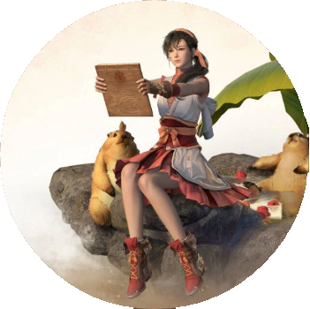
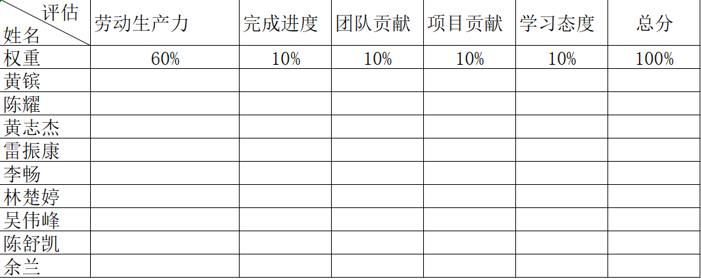

# 团队作业第一次

|这和作业属于哪个课程|[2021春软件工程实践 S班(福州大学)](https://edu.cnblogs.com/campus/fzu/FZUSESPR21)|
|--|:--:|
|这个作业要求在哪里|[团队作业第一次](https://edu.cnblogs.com/campus/fzu/FZUSESPR21/homework/11847)|
|团队名称|[青青草原](https://www.cnblogs.com/qqcyfzu/)|
|这个作业的目标|展现团队风采、初步介绍团队项目、设计团队绩效考核方式|
|其它文献参考|无|

目录
[toc]
### 👇团伙大名
>青青草原
***
### 👨‍💻团队项目描述
>致力于为福大人创建一个可以省钱及获取生活中便利、物美价廉的信息的平台。
***
### 💃队员风采🕺
##### 👦spirit 
- 学号：221801116
- 成员博客地址地址：https://www.cnblogs.com/spititcskblog
- 成员性格：迟缓，稳定
- 擅长的技术：Java后端
- 兴趣爱好：篮球，电影
- 希望的软工角色：后端开发，测试
- 一句slogan：放下包袱，开动机器

##### 👦YellowBean 
- 学号：221801410
- 成员博客地址地址：https://www.cnblogs.com/410hb/
- 成员性格：百变
- 擅长的技术：Java编程
- 兴趣爱好：看电影、旅游、吃甜品
- 希望的软工角色：后端开发
- 一句slogan：但尽人事，莫问前程。

##### 👧Chutiiing 
- 学号：221801438
- 成员博客地址：https://www.cnblogs.com/chutiiing
- 成员性格：乐观积极
- 擅长技术：iOS编程
- 兴趣爱好：吃美食、看综艺
- 希望的软工角色：前端开发
- 一句slogan：为了心里的远方，努力成为更好的自己。

##### 👦岑缨 
- 学号：041801406
- 成员博客地址地址：https://www.cnblogs.com/h2j-/
- 成员性格：欢快,随意
- 擅长的技术：PS,前端
- 兴趣爱好：花钱
- 希望的软工角色：前端制作,美工
- 一句slogan：与其感慨路难行,不如马上出发

##### 👦杨子申
- 学号：221801116
- 成员博客地址地址：https://www.cnblogs.com/yangzishen/
- 成员性格：自来熟
- 擅长的技术：Java
- 兴趣爱好：音乐，篮球，电影
- 希望的软工角色：持续学习，满足组织需要！
- 一句slogan：遇到BUG不要慌  试试冰冷昂贵入云涉水的轻身术

##### 👦Energy 
- 学号：221801432
- 成员博客地址地址：https://www.cnblogs.com/nokiblogs/
- 成员性格：儒雅随和
- 擅长的技术：Java
- 兴趣爱好：电影，打游戏
- 希望的软工角色：后端
- 一句slogan：想当欧皇

##### 👧zzong 
- 学号：221801430
- 成员博客地址：https://www.cnblogs.com/zzong/
- 成员性格：慢热、随和
- 擅长的技术：UI设计
- 兴趣爱好：看剧、看书
- 希望的软工角色：UI or前端
- 一句slogan：开心最重要

##### 👦六元一斤虾
- 学号：221801214
- 成员博客地址地址：https://www.cnblogs.com/lzklzk/
- 成员性格：开朗
- 擅长的技术：java开发
- 兴趣爱好：追剧看书
- 希望的软工角色：后端开发
- 一句slogan：有志者事竟成

##### 👦硅与神经键
- 学号：221801429
- 成员博客地址地址：https://www.cnblogs.com/koopi/
- 成员性格：稳重
- 擅长的技术：Java/Python后端
- 兴趣爱好：电影，购物
- 希望的软工角色：后端开发
- 一句slogan：不出bug就算成功

***
### 📸团队合照

***
### 📈绩效考核方案
> 采用背对背评比（2.0）形式，让团队公平公正地对队员目共睹对的贡献进行评价并结合队员自评。细分规则如下：
>* 按照每人满分一百分的方式,每个队友进行互评,取平均分。再将100分进行拆分。
>1. 任务分配,每个人的任务占比60%。（按照任务的难度,完成情况进行给分）
>2. 完成时间，按时完成占10%。（如果逾期酌情扣分）
>3. 整体贡献，对团队做出的贡献,帮忙找资料等占10%。
>4. 项目之外的工作，进行修改bug,编写文档、博文等占比10%。
>5. 态度分，参与讨论及会议的积极程度，学习态度有没有学,愿不愿意去学习来给分占10%。
>* 最终自评占20%，互评后取平均分占80%。
>* 评分表如下：

***
### 🙏团队愿景
>* 我们的团队项目功能以记账为主。我们打算把记账功能设计成集易于使用、美观简洁、高效记账、云端同步等特点于一身。并在记账这一基础上，将为福大人谋福的这一想法发扬光大，可以在小程序中分享便捷的生活信息，其他功能有助于个人消费的规划、完善记账功能。最终制作出一款有特色的记账小程序。
>
>* 以小程序的方式实现，不用下载也是推广的一大优势，每一个微信用户都可以随时随地体验这款记账小程序，有庞大的潜在用户量。
>* 我们希望在未来团队中每个成员都越来越默契、互相熟悉、成为好兄弟好姐妹；在工作中互相帮助；在平时也彼此关照；有共同的目标，认真对待团队项目。期待我们团队付出时间精力完成的项目能真正运用于生活中，满足每个用户的记账需求，帮助他们理财，省下一个亿。
