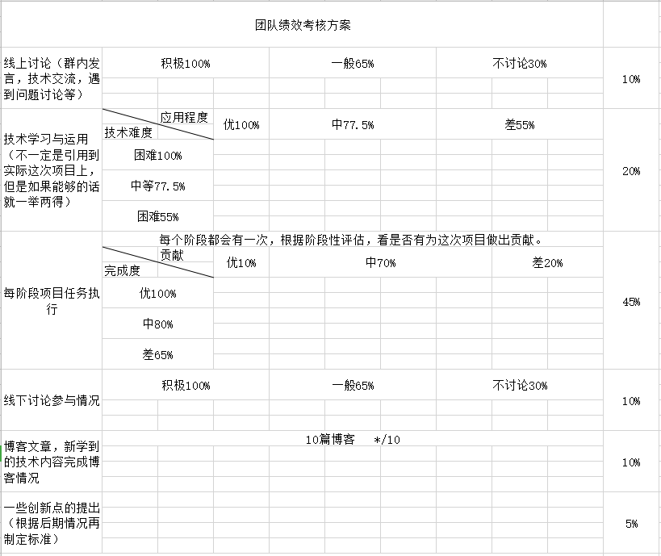

### 作业基本信息
<table>
    <tr>
        <th>这个作业属于哪个课程</th>
        <th>
            <a href="https://edu.cnblogs.com/campus/fzu/FZUSESPR21" style="text-decoration:none;">2021春软件工程实践|S班</a>
            <a href="https://edu.cnblogs.com/campus/fzu" style="text-decoration:none;">(福州大学)</a>
        </th>
    </tr>
    <tr>
        <td>这个作业要求在哪里</td>
        <td>
            <a href="https://edu.cnblogs.com/campus/fzu/FZUSESPR21/homework/11847">团队作业第一次</a>
        </td>
    </tr>
    <tr>
        <td>团队名称</td>
        <td>
            峡谷partners
        </td>
    </tr>
    <tr>
        <td>这个作业的目标</td>
        <td>
            团队描述，展示团队风采，描述团队愿景
        </td>
    </tr>
    <tr>
        <td>其他参考文献</td>
        <td>
            <a href="https://www.csdn.net/" style="text-decoration:none;">CSDN</a>
            
,

            <a href="https://github.com/" style="text-decoration:none;">GitHub</a>
        </td>
    </tr>
</table>

### 团队项目描述
仿照王者荣耀的手游开发，在其基础上进行创新改变

### 队员风采
<table>
<tr>
<th>学号</th>
<th>221801335</th>
</tr>
<tr>
<td>成员姓名</td>
<td>洪hh</td>
</tr>
<tr>
<td>博客园地址</td>
<td><a href="www.cnblogs.com">点击这里</a></td>
</tr>
<tr>
<td>成员性格</td>
<td>老直男性格了，不会说话，但是有自己的那一份坚持</td>
</tr>
<tr>
<td>擅长的技术</td>
<td>U3D引擎使用，游戏客户端开发，网络开发</td>
</tr>
<tr>
<td>兴趣爱好</td>
<td>游戏开发  玩玩游戏  听听音乐</td>
</tr>
<tr>
<td>软工角色</td>
<td>游戏客户端开发</td>
</tr>
<tr>
<td>Slogan</td>
<td>生活不止眼前的苟且，还有远方的</td>
</tr>
</table>

<table>
<tr>
<th>学号</th>
<th>221801135</th>
</tr>
<tr>
<td>成员姓名</td>
<td>头壳康康</td>
</tr>
<tr>
<td>博客园地址</td>
<td><a href="https://home.cnblogs.com/u/Flutpiggip">点击这里</a></td>
</tr>
<tr>
<td>成员性格</td>
<td>乐观，随性</td>
</tr>
<tr>
<td>擅长的技术</td>
<td>U3D，Ue4</td>
</tr>
<tr>
<td>兴趣爱好</td>
<td>玩游戏</td>
</tr>
<tr>
<td>软工角色</td>
<td>脚本</td>
</tr>
<tr>
<td>Slogan</td>
<td>卷！</td>
</tr>
</table>

<table>
<tr>
<th>学号</th>
<th>221801439</th>
</tr>
<tr>
<td>成员姓名</td>
<td>陆吉杉</td>
</tr>
<tr>
<td>博客园地址</td>
<td><a href="https://www.cnblogs.com/liliku/">点击这里</a></td>
</tr>
<tr>
<td>成员性格</td>
<td>稳重沉着</td>
</tr>
<tr>
<td>擅长的技术</td>
<td>前端开发，Java</td>
</tr>
<tr>
<td>兴趣爱好</td>
<td>球类运动，如羽毛球、乒乓球</td>
</tr>
<tr>
<td>软工角色</td>
<td>测试</td>
</tr>
<tr>
<td>Slogan</td>
<td>未来的自己会感谢现在努力奋斗的你</td>
</tr>
</table>

<table>
<tr>
<th>学号</th>
<th>221801330</th>
</tr>
<tr>
<td>成员姓名</td>
<td>陈少彬</td>
</tr>
<tr>
<td>博客园地址</td>
<td><a href="https://www.cnblogs.com/weirdo123/">点击这里</a></td>
</tr>
<tr>
<td>成员性格</td>
<td>平静直率</td>
</tr>
<tr>
<td>擅长的技术</td>
<td>c语言、c++、java等</td>
</tr>
<tr>
<td>兴趣爱好</td>
<td>打桌游、打球、美食、旅游、看书</td>
</tr>
<tr>
<td>软工角色</td>
<td>测试</td>
</tr>
<tr>
<td>Slogan</td>
<td>是金子在哪都会发光的</td>
</tr>
</table>

<table>
<tr>
<th>学号</th>
<th>221801324</th>
</tr>
<tr>
<td>成员姓名</td>
<td>叶睿操</td>
</tr>
<tr>
<td>博客园地址</td>
<td><a href="https://www.cnblogs.com/boy-nextdoor/">点击这里</a></td>
</tr>
<tr>
<td>成员性格</td>
<td>沉稳，有时不爱说话，比较认真</td>
</tr>
<tr>
<td>擅长的技术</td>
<td>java后端</td>
</tr>
<tr>
<td>兴趣爱好</td>
<td>游戏，吉他</td>
</tr>
<tr>
<td>软工角色</td>
<td>后端</td>
</tr>
<tr>
<td>Slogan</td>
<td>Just do it</td>
</tr>
</table>

<table>
<tr>
<th>学号</th>
<th>221801333</th>
</tr>
<tr>
<td>成员姓名</td>
<td>林</td>
</tr>
<tr>
<td>博客园地址</td>
<td><a href="https://www.cnblogs.com/040lsl/">点击这里</a></td>
</tr>
<tr>
<td>成员性格</td>
<td>社恐</td>
</tr>
<tr>
<td>擅长的技术</td>
<td>前端，web，java，android，electron</td>
</tr>
<tr>
<td>兴趣爱好</td>
<td>玩游戏</td>
</tr>
<tr>
<td>希望的软工角色</td>
<td>前端</td>
</tr>
<tr>
<td>Slogan</td>
<td>爱与和平</td>
</tr>
</table>

<table>
<tr>
<th>学号</th>
<th>221801416</th>
</tr>
<tr>
<td>成员姓名</td>
<td>林怀颖</td>
</tr>
<tr>
<td>博客园地址</td>
<td><a href="https://www.cnblogs.com/linghuaiying/">点击这里</a></td>
</tr>
<tr>
<td>成员性格</td>
<td>活泼开朗</td>
</tr>
<tr>
<td>擅长的技术</td>
<td>移动端开发</td>
</tr>
<tr>
<td>兴趣爱好</td>
<td>球类运动</td>
</tr>
<tr>
<td>希望的软工角色</td>
<td>前端</td>
</tr>
<tr>
<td>Slogan</td>
<td>既然选择了远方，便只顾风雨兼程</td>
</tr>
</table>

<table>
<tr>
<th>学号</th>
<th>221801338</th>
</tr>
<tr>
<td>成员姓名</td>
<td>冯浩</td>
</tr>
<tr>
<td>博客园地址</td>
<td><a href="https://www.cnblogs.com/fenghaohao/">点击这里</a></td>
</tr>
<tr>
<td>成员性格</td>
<td>开朗</td>
</tr>
<tr>
<td>擅长的技术</td>
<td>用户调查、需求分析、产品设计，掌握 C 语言、C++、Java、PHP、HTML、CSS 等语言，PS、PR、墨刀、Axure Rp 等软件操作技能</td>
</tr>
<tr>
<td>兴趣爱好</td>
<td>音乐、旅行、摄影、长跑</td>
</tr>
<tr>
<td>希望的软工角色</td>
<td>产品</td>
</tr>
<tr>
<td>Slogan</td>
<td>既然选择了远方，便只顾风雨兼程</td>
</tr>
</table>

### 团队的首次合照

### 团队绩效考核方案

### 团队愿景
<li>选题初衷
<ul>对开发游戏有浓厚的兴趣，希望能够在开发游戏的过程中不断精进自己的技术。玩游戏能够在过于紧张或疲惫的时候放松身心，同时可以制定玩法场景等满足自己对游戏的需要。</ul>
</li>

<li>预计实现程度
<ul>实现一个王者战斗系统和匹配系统并在此基础上进行模式改变。</ul>
</li>

<li>项目应用
<ul>作为仿制王者的游戏项目可以给玩家带来娱乐</ul>
</li>

<li>愿景
<ul>

希望能够在完成基本的游戏所需功能后开发一些创新玩法，制作出受欢迎的游戏。

希望在团队合作中每个人积极参与配合，互帮互助。

希望所有队员都能有所收获，能够增强开发技术，提升专业技能和素质，更加了解团队合作机制，锻炼团队合作能力，积累项目经验，共同进步。

</ul>
</li>