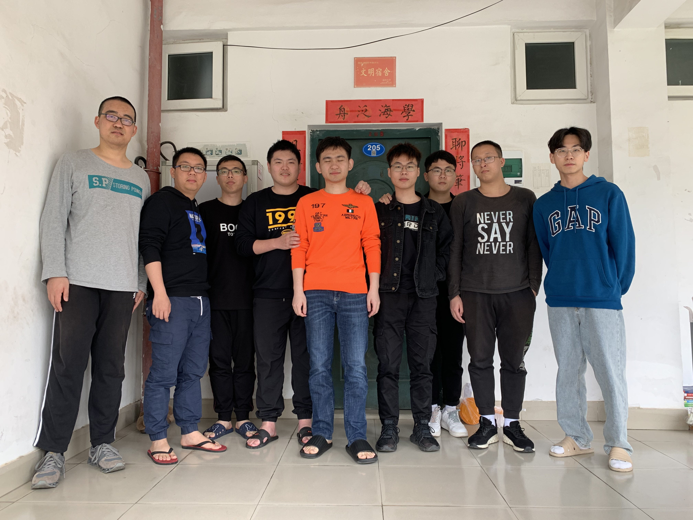

|这个作业属于哪个课程|[2021春软件工程实践S班](https://edu.cnblogs.com/campus/fzu/FZUSESPR21)|
|--    |--    |
|这个作业的要求 |[点这试试看](https://edu.cnblogs.com/campus/fzu/FZUSESPR21/homework/11847)|
|团队名称 |福大周润发队|
|这个作业的目标|设计出一款，可在宿舍玩的卡牌桌游，包括但不限于“筹码”“加注”“弃牌”等博弈玩法|
|其他参考文献|《Java核心技术卷I》《Java核心技术卷II》《构建之法》 |
[toc]
## 团队项目描述
我们想设计一款网上玩不到的”卡牌博弈游戏“！

## 队长队员风采
+ ### [队长柯少彬](https://www.zybuluo.com/cmd/)
    学号：041801114
    成员姓名（可以用昵称替代）： rr2
    成员博客园地址  https://www.cnblogs.com/rrtwo/
    成员性格：机制好学，热心助人。有很强的逻辑思维，
    擅长的技术 ：C/C++/Java（Swing与JavaFX）/C#（WinForm）、MySQL、OpenGL etc.
    兴趣爱好： CG、算法、游戏引擎
    希望的软工角色：游戏UI、后端
    一句slogan： 纸上得来终觉浅，绝知此事要躬行。
+ ### [队员陈杉](https://www.zybuluo.com/cmd/)
    学号：131801208
    成员姓名：本多猪四郎 
    性格爱好：乐于助人，和队长柯少彬一样喜欢动漫
    擅长的技术：Java，Axure，Eclipse，Visio，Xmind，SQL，Office，Python，androidstudio，
    希望的软工角色：java前端开发，后端开发，安卓开发；
    一局slogan：乾坤未定，你我皆是牛马
+ ### [队员李家成](https://www.zybuluo.com/cmd/)
    •	    成员性格：积极随和
    •	    擅长的技术：c，c++，java，c#
    •	    兴趣爱好：无
    •	    希望的软工角色：哪里有需要去哪里，前后端都可以试一试
    •	    一句slogan：读书破万卷，下笔如有神
+ ### [队员陈力涵](https://www.zybuluo.com/cmd/)
    学号：031801133
    网名：Hans
    博客园地址：https://www.cnblogs.com/Hans-LYT/
    性格：憨厚老实
    擅长的技能：数据分析
    爱好：跑步 数学
    偏向：测试
    一句slogan：柯少彬yyds
+ ### [队员陈皓宇](https://www.zybuluo.com/cmd/)
    学号姓名：031801124 断桥残雪
    •	    成员性格：随和。哪里需要往哪儿搬
    •	    擅长的技术：c，c++，java，c#都会一点。
    •	    兴趣爱好：后端
    •	    希望的软工角色：希望做java后端，与我的技术成长路线也有关
    •	    一句slogan：唯有学习使我快乐
+ ### [队员梁扬新](https://www.zybuluo.com/cmd/)
    学号：221801130	
    成员姓名：梁扬新
    成员博客园地址：https://www.cnblogs.com/liangyangxin/
    成员性格：活泼开朗话真多
    擅长的技术：java、mysql，都只会皮毛，不够深入
    兴趣爱好：吃喝玩乐赚大钱
    希望的软工角色：后端（正在学习中）
    一句slogan：他强任他强，我宰我的羊。
+ ### [队员黄凯荣](https://www.zybuluo.com/cmd/)
    学号：221801110
    成员姓名：hkr
    成员博客园地址：https://www.cnblogs.com/hkr-blog/
    成员性格：文静内敛随和
    擅长的技术：C、Java、Android开发都会一点
    兴趣爱好：吃饭睡觉看动漫
    希望的软工角色：测试（学习中）
    一句slogan：天道酬勤
+ ### [队员池毓地](https://www.zybuluo.com/cmd/)
    学号：221801109
    姓名：昵称就为空
    博客园地址：https://www.cnblogs.com/secyd/
    性格：忍耐、沉稳
    擅长技术：没有太擅长的。。。
    兴趣爱好：音乐
    希望的软工角色：测试
    slogan：菜鸡落泪
+ ### [队员黄钰栋](https://www.zybuluo.com/cmd/)
    学号：221801105
    姓名：黄钰栋
    博客园地址：
    https://www.cnblogs.com/AgCl9/
    性格：随和
    擅长的技术：C++
    兴趣爱好：play game
    希望的软工角色：
    一句slogan:努力学习，力争上游。
## 团队合照

##绩效考核表
| 学号        | 工作内容   |  工作完成度  |工作评价|总体评价等级|
| --------    | :-----:    | :----:       |:----:  |:----:      |
| 041801114   |            |              |        |            |
| 131801208   |            |              |        |            |
| 071808114   |            |              |        |            |
| 221801109   |            |              |        |            |
| 031801133   |            |              |        |            |
| 221801105   |            |              |        |            |
| 031801124   |            |              |        |            |
| 221801110   |            |              |        |            |
| 221801130   |            |              |        |            |
## 团队愿景
+ 选题的初衷是，我们希望能在宿舍玩一下类似“炸金花”这种游戏、最初的发起者，就是因为在网上玩不到这种游戏
才想自己设计胜负判定条件，但我们希望做出一款不亚于欢乐斗地主那种UI界面的桌游，不仅仅是一堆的数据“因为
没人喜欢和一堆数据打交道，包括程序员”。项目目前的想法是能在局域网内进行游戏，因为初衷就是宿舍游戏嘛。
+ 我们团队虽然技术都不咋样，但我们希望能在未来的合作中做到，有问必答，有求必应，群聊积极，人人都有意见
并且愿意抢着为游戏进行改进。我们希望能做的比预期的”最差方案“好，无限接近于 欢乐斗地主 那种界面的游戏。
人人都能在团队作业中有收获。
  + 发起者能收获分工经验，接口设计经验。
  + 测试，编码者不同的模块之间能通畅的交流。

 &nbsp;&nbsp;&nbsp;&nbsp;&nbsp;游戏虽然简单，但努力的做好游戏，磨合团队关系并不简单。
