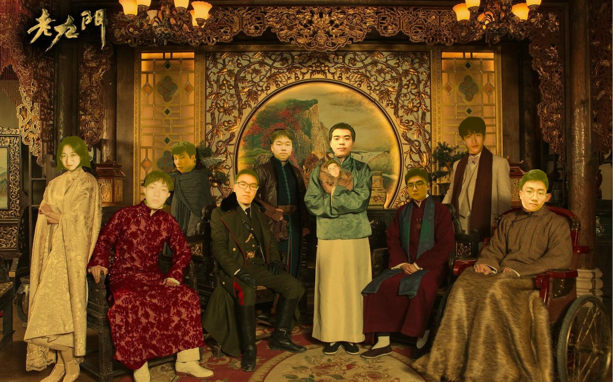
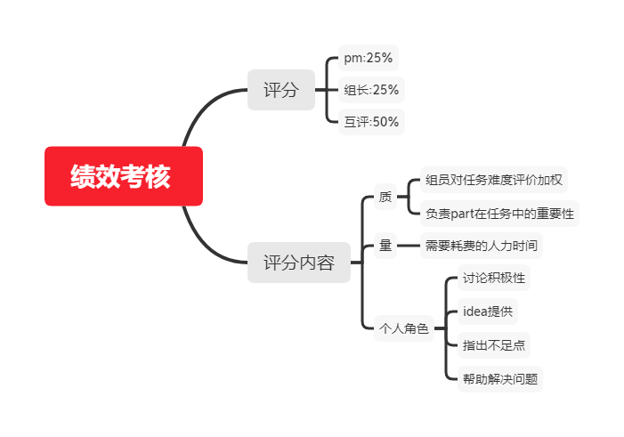

|这个作业属于哪个课程|[2021春软件工程实践S班 (福州大学)](https://edu.cnblogs.com/campus/fzu/FZUSESPR21)|
|--    |--    |
|这个作业要求在哪里|[团队作业第一次](https://edu.cnblogs.com/campus/fzu/FZUSESPR21/homework/11847)|
|团队名称|老九门|
|这个作业的目标|1、组队并选定项目题目 2 、讨论考核方案 3、生成NABCD模型，形成选题PPT 4、设计评审表（腾讯文档，10分制） 5、在cnblogs上创建一个团队博客|
|其他参考文献| 《构建之法》  |

[toc]
## 一、队名
老九门
## 二、团队项目描述 
老九门校园二手交易平台，没有中间商赚差价。

## 三、队员风采

|  康伟泽 |      |
| ---- | ---- | ---- |
|   学号   |    221801111  |
|   成员姓名   |    K  |
|   成员博客园地址  |    https://www.cnblogs.com/111K/  |
|   成员性格   |    随和  |
|   擅长的技术   |    Java  |
|   兴趣爱好   |    听音乐、跑步、打游戏   |
|   希望的软工角色   |    后端/测试  |
|   slogan   |   吹最牛的逼，干最少的活！！！   |  
  
|  林明昊 |      |
| ---- | ---- | ---- |
|   学号   |    221801115  |
|   成员姓名   |    林明昊  |
|   成员博客园地址  |    https://www.cnblogs.com/entsjtsmf/  |
|   成员性格   |    乱七八糟  |
|   擅长的技术   |    Java  |
|   兴趣爱好   |    电影电视剧   |
|   希望的软工角色   |    后端  |
|   slogan   |   重铸九门荣光 我辈义不容辞   |
  
|  张骁 |      |
| ---- | ---- | ---- |
|   学号   |    221801122  |
|   成员姓名   |    张骁  |
|   成员博客园地址  |    https://www.cnblogs.com/zxcnblogs/  |
|   成员性格   |    大方积极  |
|   擅长的技术   |    都会一点点  |
|   兴趣爱好   |    动漫，刷剧   |
|   希望的软工角色   |    测试，前端  |
|   slogan   |   老九门冲！   |
  
|  傅江峰 |      |
| ---- | ---- | ---- |
|   学号   |    221801131  |
|   成员姓名   |    傅江峰  |
|   成员博客园地址  |    https://www.cnblogs.com/fu12138/  |
|   成员性格   |    和蔼可亲  |
|   擅长的技术   |    web前端  |
|   兴趣爱好   |    影视鉴赏，电子竞技，经典品读   |
|   希望的软工角色   |    前端和测试  |
|   slogan   |   月落乌啼霜满天   |
  
|  李淇 |      |
| ---- | ---- | ---- |
|   学号   |    221801132  |
|   成员姓名   |    李淇  |
|   成员博客园地址  |    https://www.cnblogs.com/kksnz/  |
|   成员性格   |   正直  |
|   擅长的技术   |    c语言  |
|   兴趣爱好   |    打游戏   |
|   希望的软工角色   |    前端  |
|   slogan   |   《构建之法》真好看   |
  
|  宋日荣 |      |
| ---- | ---- | ---- |
|   学号   |    221801108  |
|   成员姓名   |    Srr  |
|   成员博客园地址  |    https://www.cnblogs.com/srrsrr/  |
|   成员性格   |   认真负责  |
|   擅长的技术   |    Java  |
|   兴趣爱好   |   音乐、篮球、跑步   |
|   希望的软工角色   |    前端或后端  |
|   slogan  |   每根头发都有属于它的名字  |
  
|  王冠儒 |      |
| ---- | ---- | ---- |
|   学号   |    221801136  |
|   成员姓名   |   王冠儒  |
|   成员博客园地址  |   https://www.cnblogs.com/luluCoding/  |
|   成员性格   |   外向活泼  |
|   擅长的技术   |    Java  |
|   兴趣爱好   |   睡觉，打球   |
|   希望的软工角色   |    前端 |
|   slogan |   多读书，多看报，少吃零食，多睡觉。  |
  
|  陈鹏桢 |      |
| ---- | ---- | ---- |
|   学号   |    221801233  |
|   成员姓名   |   Jerome  |
|   成员博客园地址  |   https://www.cnblogs.com/cpz1/  |
|   成员性格   |   幽默,开朗  |
|   擅长的技术   |    Java,C#  |
|   兴趣爱好   |   网球,吉他,书法   |
|   希望的软工角色   |   PM/后端  |
|   slogan   |   木叶飞舞之处,火亦生生不息   |
  
|  黄隽芊 |      |
| ---- | ---- | ---- |
|   学号   |    221801232  |
|   成员姓名   |   小黄  |
|   成员博客园地址  |  https://www.cnblogs.com/hjqColbert/  |
|   成员性格   |   随和 |
|   擅长的技术   |    获取资料  |
|   兴趣爱好  |   食物，画画，音乐   |
|   希望的软工角色   |   测试，PM，前端  |
|   slogan   |   生活永远美好   |

## 四、团队的首次合照

## 五、团队绩效考核方案

## 六、团队的愿景
我们要做的是一个定位是在本校园内的二手交易平台，使得学生们可以通过这个平台实现闲置物品的交易。它可以方便学生间的二手交易，并提供可靠保障，最大程度地减少欺诈事件发生。由于平台双方交易不经过中间商，保障了交易的自由度和最大限度的保价，我们希望能做到能够让这个平台正式使用的程度，在部署服务器后可以直接投入使用。由于校园内部目前存在的二手交易还局限于QQ群内部交流，从我们自身的角度出发，有时会因为消息滞后的情况而错过购买时机，而校园内部又存在许多资源可以重复利用的情况，比如书籍，各类工具等等，从卖家方面，可以省去在网上二手平台的繁杂手续，保证资源第一时间出手；从买家方面,在保证优惠的二手价同时，又可以解决燃眉之急。我们希望这是一个大家在日后购买交易校园可重复利用资源时第一时间想到的渠道，也为每一位同学的生活带去便利。
