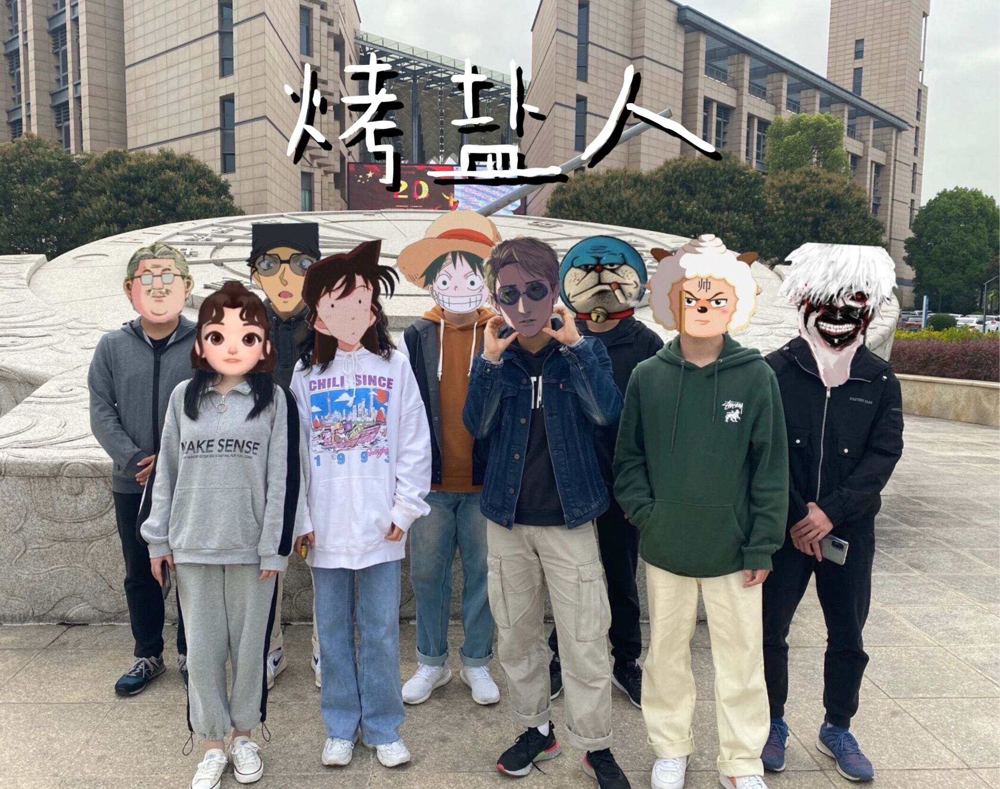

| 这个作业属于哪个课程 | [首页 - 2021春软件工程实践\|S班 - 福州大学 - 班级博客 - 博客园 (cnblogs.com)](https://edu.cnblogs.com/campus/fzu/FZUSESPR21/) |
| :------------------- | :----------------------------------------------------------- |
| 这个作业要求在哪里   | [团队作业第一次 - 作业 - 2021春软件工程实践\|S班 - 班级博客 - 博客园 (cnblogs.com)](https://edu.cnblogs.com/campus/fzu/FZUSESPR21/homework/11847) |
| 团队名称             | 烤盐人                                                       |
| 这个作业的目标       | 组建团队、初步分析项目需求、制定团队绩效考核方案             |
| 其他参考文献         | 博客园                                                       |

[toc]

## 团队名

烤盐人

## 团队项目描述

一站式考研论坛，方便考研人快捷地获取考研资讯以及和其他同学在论坛上交流心得。

## 队员风采

| 学号       | 221801314                        |
| ---------- | -------------------------------- |
| 成员姓名   | Starlite                         |
| 博客园地址 | https://www.cnblogs.com/starlite |
| 性格       | 慢热、积极乐观                   |
| 擅长的技术 | java                             |
| 兴趣爱好   | 游戏，动漫，运动                 |
| 希望的角色 | PM/前端                          |
| slogan     | Try harder                       |

| 学号       | 221801310                           |
| ---------- | ----------------------------------- |
| 成员姓名   | t0p1Crayon                          |
| 博客园地址 | https://www.cnblogs.com/t0p1Crayon/ |
| 性格       | 开朗外向、积极乐观                  |
| 擅长的技术 | java                                |
| 兴趣爱好   | 运动                                |
| 希望的角色 | 后端                                |
| slogan     | 付出所有的青春不留遗憾              |

| 学号       | 221801226                          |
| ---------- | ---------------------------------- |
| 成员姓名   | hannahShaw                         |
| 博客园地址 | https://www.cnblogs.com/hannahShaw |
| 性格       | 外向                               |
| 擅长的技术 | 搜索                               |
| 兴趣爱好   | 视频                               |
| 希望的角色 | PM/美工/前端                       |
| slogan     | Get things done                    |

| 学号       | 221801127                             |
| ---------- | ------------------------------------- |
| 成员姓名   | 谷雨yu                                |
| 博客园地址 | https://www.cnblogs.com/fzu221801127/ |
| 性格       | 熟悉后逐渐外向                        |
| 擅长的技术 | java                                  |
| 兴趣爱好   | bilibli                               |
| 希望的角色 | 前端/后端                             |
| slogan     | I can learn                           |

| 学号       | 221801203                       |
| ---------- | ------------------------------- |
| 成员姓名   | Gaoann                          |
| 博客园地址 | https://www.cnblogs.com/gaoann/ |
| 性格       | 内向                            |
| 擅长的技术 | 无                              |
| 兴趣爱好   | 弹钢琴，打篮球                  |
| 希望的角色 | 前端                            |
| slogan     | 加油！                          |

| 学号       | 221801235                       |
| ---------- | ------------------------------- |
| 成员姓名   | retrospection                   |
| 博客园地址 | https://www.cnblogs.com/-ways-/ |
| 性格       | 慢热                            |
| 擅长的技术 | vue                             |
| 兴趣爱好   | 运动                            |
| 希望的角色 | 前端/后端                       |
| slogan     | Taking my time,step by step.    |

| 学号       | 221801325                            |
| ---------- | ------------------------------------ |
| 成员姓名   | 羊一                                 |
| 博客园地址 | https://www.cnblogs.com/yangyi16123/ |
| 性格       | 开朗积极热情                         |
| 擅长的技术 | java                                 |
| 兴趣爱好   | 跑步、街舞                           |
| 希望的角色 | 后端                                 |
| slogan     | 冲冲冲！                             |

| 学号       | 221801319                            |
| ---------- | ------------------------------------ |
| 成员姓名   | 郑开心                               |
| 博客园地址 | https://www.cnblogs.com/zhengkaixin/ |
| 性格       | 开朗                                 |
| 擅长的技术 | java python                          |
| 兴趣爱好   | 运动                                 |
| 希望的角色 | 后端                                 |
| slogan     | 努力向前                             |

| 学号       | 221801334                     |
| ---------- | ----------------------------- |
| 成员姓名   | 星夜的风                      |
| 博客园地址 | https://www.cnblogs.com/xydf/ |
| 性格       | 随便                          |
| 擅长的技术 | C++                           |
| 兴趣爱好   | 睡觉                          |
| 希望的角色 | 后端                          |
| slogan     | Keep going                    |

## 团队大合照

## 团队绩效考核方案——贡献分规则

参考博客https://www.cnblogs.com/Thewillman/p/13857571.html#autoid-3-0-0

由组长统筹全局，进行任务的分配，跟进各组员的进度。

基础分 (一人兼多职取最高，组长在所负责岗位最高基础分上+2分)

产品经理: 8

前端: 6 (小组长9)

后端: 6 (小组长9)

贡献度计算如下：

$W_{个人} = (S_{个人基础}+\sum{个人得分})/(S_{所有人总分}+\sum{所有人得分})*100\%$

每次进行相关项目就进行贡献分更新。

组长得分标准（组长一人多职，这里多为扣分项）：

| 项目         | 细节                                     | 加减分       |
| ------------ | ---------------------------------------- | ------------ |
| 布置任务时间 | 在组员完成本阶段任务后接着发放任务       | +0.5         |
|              | 空档一天                                 | +0           |
|              | 空档一天以上                             | 每空开一天-1 |
| 交流         | 一天内跟进负责人任务进度，交流任务难点   | +0           |
|              | 超过一天没有跟进负责人任务进度           | 每过一天-1   |
|              | 在任务发布后没有和另一个产品经理交接情况 | 每过一天-1   |
| 风险问题     | 在发现项目问题时及时向老师和前辈询问解法 | +0           |
|              | 项目问题搁置一天及以上                   | 每过一天-1   |

组员任务得分标准：（由组长下发任务，决定细节）

| 项目     | 细节                                                         | 加减分 |
| -------- | ------------------------------------------------------------ | ------ |
| 提交时间 | 准时                                                         | +0     |
|          | 迟交                                                         | -2     |
| 气氛     | 保持996阳光向上程序员风格                                    | +0     |
|          | 在组内传播不利组内团结的负能量（例如任务还没尝试就一直在抱怨太难入手，鼓动别人一起跳槽） | -1     |
| 代码质量 | 质量很好，可扩展/复用，算法要尽量高效                        | +2     |
|          | 质量合格，达到基本要求                                       | +0     |
|          | 质量较差，需要改进                                           | -1     |
| 难度     | 基本没有技能需求，不需要太多思考                             | +0.5   |
|          | 需要一些技能基础，难度适中，或需要较大思考                   | +1     |
|          | 坑很多，解决需要消耗不少时间，需要有较强的解决问题能力       | +1.5   |
|          | 小组内其他成员做不到                                         | +2     |

一些注意事项：

1、质量上主张追求**可扩展/复用**，代码执行尽量**高效**

2、质量较差就是指，**接口无法对上**或者**程序响应时间过于冗长**，无法实现对应功能等（如有碰到技术问题可以和组长申请）

3、难度等级在实际实行中若觉得组长**错误估计了任务难度**，可与组长沟通适当调整。

## 团队愿景

​	选取这个主题，首先就是团队中许多队员都有考研的意向同时也都在收集考研相关信息时存在诸多困难，就有了这个选题。我们计划打造一个一站式的考研信息论坛，同时也提供不同研友在我们的论坛上交流各种经验感悟，希望能将论坛实现到能让用户很舒适地搜索绝大部分需要的考研信息，而不用切换多个网页检索。同时融合机器学习进行文章推荐，提升用户使用体验。最后希望我们的产品能在福大考研同学的范围内被广泛使用，成为他们考研路上得力的小帮手。

​	而团队方面则希望大家能通过这一实践过程都提升自己的专业能力和合作能力，也希望通过这样的组队能让大家培养出深厚的友谊和彼此信任。