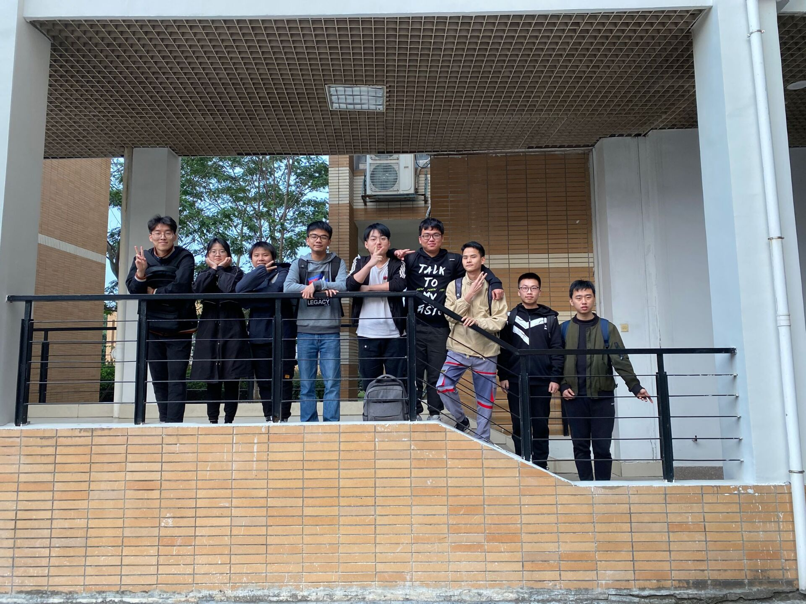

| 这个作业属于哪个课程   | **[2021春软件工程实践S班](https://edu.cnblogs.com/campus/fzu/FZUSESPR21/)** |
| ---------------------- | :----------------------------------------------------------: |
| **这个作业要求在哪里** | **[作业要求](https://edu.cnblogs.com/campus/fzu/FZUSESPR21/homework/11847)** |
| **团队名称**           |                      **饱满骑士开发组**                      |
| **这个作业目标**       | **学习掌握unity游戏引擎，学习游戏建模以及游戏美工，实现基本的冒险类小游戏** |
| **其他参考文件**       |                       **《构建之法》**                       |

#### 队名：饱满骑士开发组

#### 项目描述：实现类似《空洞骑士》的冒险类游戏

#### 队员风采：

- 221801205    gz丶

    [博客地址](https://www.cnblogs.com/gzblog/)

    性格：随和、内敛

    擅长的技术：java

    兴趣爱好：动漫

    希望的软工角色：后端

    slogan：你有多努力，就有多优秀。

- 221801228    戊子年

    [博客地址](https://home.cnblogs.com/u/wuzinian)

    性格：随和

    擅长的技术：C++

    兴趣爱好：游戏

    希望的软工角色：后端

    slogan：细节决定成败。

- 221801216    Caighter

    [博客地址](https://www.cnblogs.com/caighter/)

    性格：乐观

    擅长的技术：没有擅长的

    兴趣爱好：听音乐、泡芙、追剧、打球

    希望的软工角色：unity（哈哈哈因为组里只剩这个角色了）

    Slogan：just do it.

- 221801234    wwsse

    [博客地址](https://www.cnblogs.com/wwsse/)

    性格：开朗

    擅长的技术：java

    兴趣爱好：打游戏

    希望的软工角色：后端

    Slogan：为之，则难者亦易矣；不为，则易者亦难矣。

- 221801229    特锦

    [博客地址](https://www.cnblogs.com/LittleShyyy/)

    性格：shy

    擅长的技术：没有

    兴趣爱好：学习

    希望的软工角色：后端

- 221801339    周小美

    [博客地址](https://www.cnblogs.com/zmt-blackpink-JL/)

    性格：被迫的时候积极乐观

    擅长的技术：没有特别擅长的技术

    兴趣爱好：足球

    希望的软工角色：后端、美工建模

    Slogan：争取做一个会写游戏的体育老师？

- 221801202    蒲公英吹啊吹

    [博客地址](https://www.cnblogs.com/Lious-Rios/)

    性格：随和、幽默

    擅长的技术：C#，java

    兴趣爱好：玩游戏，做游戏，打篮球

    希望的软工角色：后端，美工设计、建模

    Slogan：全部困难都木大。

- 221801212    SXR

    [博客地址](https://www.cnblogs.com/xirensblog/)

    性格：平静

    擅长的技术：C#

    兴趣爱好：刷搞笑视频

    希望的软工角色：游戏行动逻辑编写

    Slogan：奥力给！！！

- 221801211    S灬J

    [博客地址](https://www.cnblogs.com/sfjzz/)

    性格：开朗

    擅长的技术：C++

    兴趣爱好：追剧，游戏

    希望的软工角色：后端

    Slogan：走自己的路让别人说去吧。

#### 团队首次合照：

#### 团队绩效考核方案：

**团队每个人给其他8人打分，打分项为：团队贡献、项目贡献。去掉最高和最低分取平均值。**

#### 选题初衷及团队的愿景：

##### 选题初衷：

我们都比较喜欢玩游戏，也一直有一个能够自己做一款游戏的想法，我们综合了大家的想法以及想法的可实现性决定一起开发一款2D冒险游戏。

对于游戏的开发规划，我们的目标是：

1.能实现人物的形象设计以及任务的移动（包括跑，跳以及二段跳等操作）的动画效果，人物攻击的动画效果。

2.怪物的形象设计和怪物的攻击方式和攻击效果。

3.地图的路线和障碍设置。

4.关卡的设置。

5.主线任务的剧情发展，给游戏添加背景故事。

希望该游戏能够基本满足大家的游戏娱乐需求，在进一步完善优化之后希望能进入开放游戏平台供其他玩家娱乐。

##### 团队愿景：

希望大家可以积极主动的学习，有好的想法主动提出，大家精诚合作，完成好自己的任务；能够在此次合作完成项目的过程中学到东西，包括unity游戏引擎和画面美工以及建模设计，学习到在团队开发中交流进步的能力，这对未来的工作生活有很大的作用。