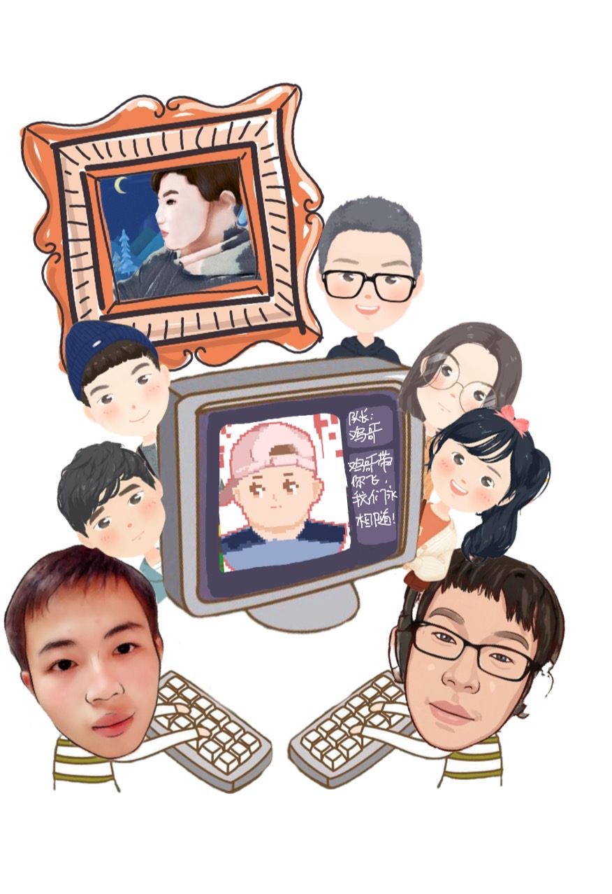

[toc]

|这个作业属于哪个课程|[2021春软件工程实践|S班](https://edu.cnblogs.com/campus/fzu/FZUSESPR21/?fileGuid=D6R6JGXyrcXHrPQk)|
|:----|:----|
|这个作业要求在哪里|[团队作业第一次](https://edu.cnblogs.com/campus/fzu/FZUSESPR21/homework/11847?fileGuid=D6R6JGXyrcXHrPQk)|
|团队名称|逐梦校友圈|
|这个作业的目标|1、简单介绍项目 2、制订绩效考核规则 3、团队个人解释和风采展示|
|其他参考文献|《构建之法》|

## **1、队名**

​	**逐梦校友圈**

## **2、团队项目描述**

希望开发一款能让大学生有认同感的“校友圈"微信小程序，通过组队自习、拼车、拼单等搅局项目让同学之间快速融入，拉近彼此的距离，增加对学校的归属感。

## **3、队员风采**

|学号姓名|221801209 ccreater|
|:----|:----|:----|
|博客园地址|[https://www.cnblogs.com/ccreater/](https://www.cnblogs.com/ccreater/p/14473533.html?fileGuid=D6R6JGXyrcXHrPQk) |
|成员性格|无|
|擅长技术|php,go,python|
|兴趣爱好|打游戏，摸鱼|
|希望的软工角色|后端|
|一句话宣言|希望能够通过本次项目实践，获得做项目的经验。同时，通过学习技能，让自己无论是在社交、生活和技术上都够有所提升。|

|学号姓名|221801222  DemoJi|
|:----|:----|
|博客园地址|博客园地址[https://www.cnblogs.com/fzuerzmj/](https://www.cnblogs.com/fzuerzmj/?fileGuid=D6R6JGXyrcXHrPQk)|
|成员性格|成员性格急性子、可能会骂人|
|擅长技术|擅长技术无特别擅长|
|兴趣爱好|兴趣爱好阅读，跑步，划水|
|希望的软工角色||
|一句话宣言|希望的软工角色后端一句话宣言快乐学习，认真对待。|

|学号姓名|221801125  丫丫丫丫丫丫比不是鸭|
|:----|:----|
|博客园地址|[https://www.cnblogs.com/yabi/](https://www.cnblogs.com/yabi/?fileGuid=D6R6JGXyrcXHrPQk)|
|成员性格|很跳脱，在熟人面前很勇，在生人面前很怂|
|擅长技术| h5，css3，js                                                 |
|兴趣爱好| 跳舞💃，追剧📕，🏊‍划水运动员                                    |
|希望的软工角色|前端&项目经理|
|一句话宣言|这一次分配到的任务是我一直都没有触碰过的，只能尽自己全部的能力保证不拖累大家，希望可以通过这一次的实践学到，积累相关的经验。|

|学号姓名|221801104|
|:----|:----|
|博客园地址|[https://www.cnblogs.com/xyh-Tse/](https://www.cnblogs.com/xyh-Tse/?fileGuid=D6R6JGXyrcXHrPQk)|
|成员性格|内敛、好相处、很会讲话|
|擅长技术| UI设计、Java、C++、eda设计                                   |
|兴趣爱好|看剧、茶艺|
|希望的软工角色|UI设计|
|一句话宣言|充实的过每一天|

|学号姓名|221801411 骑着摩托车的小螃蟹411号车手|
|:----|:----|
|博客园地址|[https://www.cnblogs.com/Cherry-XPX/](https://www.cnblogs.com/Cherry-XPX/?fileGuid=D6R6JGXyrcXHrPQk)|
|成员性格|开朗是常态，内敛是偶然、乐观、细心、敏感|
|擅长技术|C、C++、Java开发等（掌握程度一般）|
|兴趣爱好|唱歌、看电影、追剧、追星、想蹦极、跳伞|
|希望的软工角色|后端一句话宣言慧者畏因，愚者畏果。虽然因为能力不太行有些许忐忑，但是想要学好的心让我无所畏惧。希望和团队的队友们互相帮助、共同进步。 |

|学号姓名|221801321黄海翔|
|:----|:----|
|博客园地址|[https://www.cnblogs.com/yangyu-huang/](https://www.cnblogs.com/yangyu-huang/?fileGuid=D6R6JGXyrcXHrPQk)|
|成员性格|开朗、活泼|
|擅长技术| C、C++、Java、数据库开发                                     |
|兴趣爱好|玩游戏，打羽毛球，看书|
|希望软工角色|后端|
|一句话宣言|希望能够和大家一起学习新技术，和大家同进步，在此次的项目开发有所收获。|

|学号姓名|221801231 |
|:----|:----|
|博客园地址|[https://www.cnblogs.com/hsx479/](https://www.cnblogs.com/hsx479/?fileGuid=D6R6JGXyrcXHrPQk)成员性格时而内向时而外向，比较温和比较乐观|
|擅长技术|html5+css3+JavaScript|
|兴趣爱好|篮球，看美剧|
|希望的软工角色| 前端                                                         |
|一句话宣言|希望这次项目经历可以有所收获，和大家共同进步💪|

|学号姓名|221801215 Tars|
|:----|:----|
|博客园地址|[https://www.cnblogs.com/tarsss/](https://www.cnblogs.com/tarsss/?fileGuid=D6R6JGXyrcXHrPQk)|
|成员性格| 细心内向                                                     |
|擅长技术| Android、Java、一点点Flutter                                 |
|兴趣爱好|游戏、电影、音乐|
|希望的软工角色|前端|
|一句话宣言|学一学，写一写，边写边学，边学边写。|

## **4、合照**

## **5、团队绩效考核方案**

* 线上线下交流
|交流情况|积极|一般|消极|
|:----:|:----|:----:|:----|:----:|:----|:----:|:----|
|团队线上讨论|+2|+1|-1|
|技术交流|+2|+1|-1|
|问题汇报|+2|+1|-1|

【注】团队讨论：积极是指可以很好的响应当前问题，并给予有效回答

​                           消极是指对问题没有给予相应，并没有跟上团队讨论节奏

​          技术交流：积极是指可以将较好的解决方案分享，并且及时教小组成员使用

​                           消极是指有更好的解决方案却拒绝交流，或不愿分享，藏着掖着

​          问题汇报：积极是指将无法自己解决的问题如实准确汇报

​                           消极是指不注重解决问题，而选择随便应付了事，耽误团队进度

* 每次阶段任务完成情况
|每阶段任务完成情况|提前完成|按时完成|延时完成|
|:----|:----:|:----|:----:|:----|:----:|:----|
|    |+2|+1|-1|

【注】按时完成是指接近(1天内)规定时间完成

​           延时完成是指在任务合理的情况下，由于自身的某些原因导致项目延时

* 学习情况
|阶段学习情况|分数|
|:----|:----|
|从无到有，之前只是简单接触过，现已熟练掌握所需技术|+5|
|之前便能较好运用，现在游刃有余|+5|
|熟练程度一般，能解决部分问题|+3|
|基本上没怎么学，对技术仍然很生疏|-2|

* 每次派分项目当中的任务完成
|分块项目当中的内容|分数|
|:----|:----|
|较为复杂，实现较为困难，需要很扎实的技术基础|+5|
|需要考虑较多的情况，细节完成较好|+4|
|难度适中,得花些心思|+2|
|轻轻松松，有手就行|+0.5|

* 其他评分项目
|内容|分数|
|:----|:----|
|每天可以保证有有效的代码时间|+1|
|代码质量较高|+2|
|每天可以保证用积极健康的情绪|+0.5|

## **6、团队的愿景**

本科生活已经接近尾声，凭心的说，在日常生活中除了本专业本院的同学外，我们很少接触其他院系的学生，仿佛大学生活只有我们数计一个院在参与。为了让我们福州大学的各个专业的人联系起来，形成关联，增加我们对学校的归属感。我们希望通过我们本次的项目实践，实现一个可以让我们互相了解，互相关联的微信小程序平台。如果项目进展顺利，我们希望可以将程序推广到其他学校，使其他学校也可以使用。

希望我们可以在接下来的项目实践当中，积极交流，在增进自身知识面的同时，相互配合，把我们的项目一起完成好。

