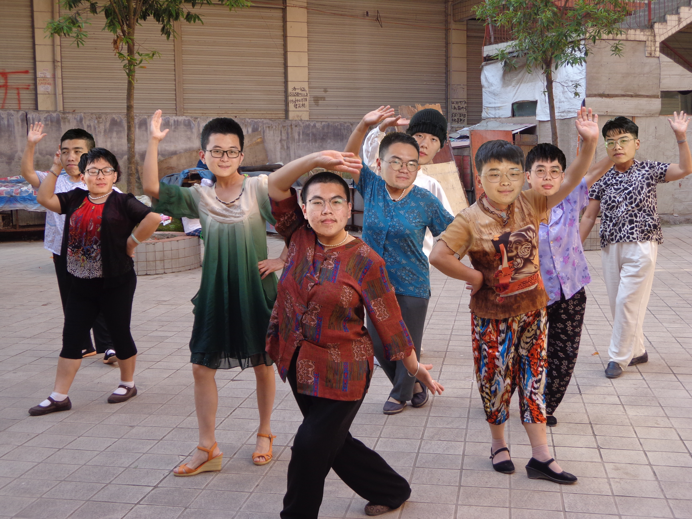
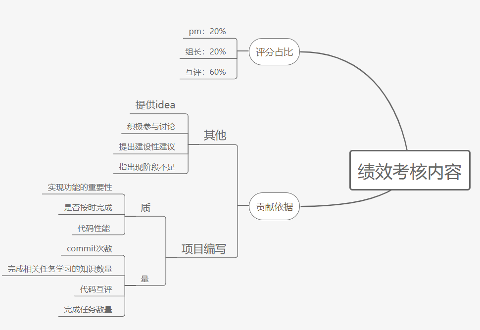

# 团队作业第一次

<table>
    <tbody>
    <tr>
        <td>这个作业属于哪个课程？</td>
        <td><a href="https://edu.cnblogs.com/campus/fzu/FZUSESPR21">2021春软件工程实践|S班（福州大学）</a>
        </td>
    </tr>
    <tr>
        <td>这个作业的要求在哪里？</td>
        <td><a href="https://edu.cnblogs.com/campus/fzu/FZUSESPR21/homework/11847">团队第一次作业</a>
        </td>
    </tr>
    <tr>
        <td>团队名称</td>
        <td>字节乱动队</td>
    </tr>
    <tr>
        <td>这个作业的目标</td>
        <td>体验团队合作，检验知识掌握</td>
    </tr>
    <tr>
        <td>参考文献</td>
        <td>《构建之法》，《Android第一行代码》</td>”
    </tr>
    </tbody>
</table>

## 一、 团队名称

- 名称：*字节乱动队*
- 来源：民主投票

## 二、**团队项目描述**

- ​	对《软件工程实践》数次个人或团队作业过程中，助教，老师和团队成员互评的评分进行数据统计，展示。

## 三、队员风采

- 队长：
  - 学号：221801101
  - 成员姓名：王思皓
  - 成员博客园地址:https://www.cnblogs.com/scott233
  - 成员性格：闷骚，拖延症晚期
  - 擅长的技术：Android，Kotlin
  - 兴趣爱好：吃饭睡觉喝奶茶敲代码
  - 希望的软工角色：写Android的
  - 一句slogan: 有志者，事竟成
- 队员：
  - 学号：221801112
  - 成员姓名：曹鑫
  - 成员博客园地址:https://www.cnblogs.com/er-gou/#begin
  - 成员性格：表里不一
  - 擅长的技术：SpringMVC(了解)
  - 兴趣爱好：吃喝玩乐。
  - 希望的软工角色：后端
  - 一句slogan: just do it

- 队员：
  - 学号：221801106
  - 成员姓名：郑龙海
  - 成员博客园地址：https://www.cnblogs.com/hector-1/
  - 成员性格：性情平和
  - 擅长的技术：JAVA
  - 兴趣爱好：动漫，唱歌
  - 希望的明星：周杰伦
  - 希望的软工角色：前端 ，后端
  - 一句slogan: 努力做好自己，活得开心点
- 队员
  - 学号：221801332
  - 成员姓名：李达明
  - 成员博客园地址:https://www.cnblogs.com/sblogs/
  - 成员性格：乐观
  - 擅长的技术：C++，Java
  - 兴趣爱好：下棋，听相声
  - 希望的软工角色：前端
  - 一句slogan: 不负遇见
- 队员
  - 学号：221801103
  - 成员姓名：牙举韬
  - 成员博客园地址:https://www.cnblogs.com/xiaosili/
  - 成员性格：和善
  - 擅长的技术： java
  - 兴趣爱好：电影、音乐
  - 希望的软工角色：后端
  - 一句slogan:天将降大任于斯人也，必先苦其心志，劳其筋骨，饿其体肤，空乏其身，行拂乱其所为也，所以动心忍性，增益其所不能。
- 队员
  - 学号：221801225
  - 成员姓名：李进明
  - 成员博客园地址:https://www.cnblogs.com/-225
  - 成员性格：喜欢自由，比较懒散，不过我也是会认真起来的
  - 擅长的技术：C语言
  - 兴趣爱好：羽毛球、游戏、动漫、音乐
  - 希望的软工角色：前端，以及力所能及的事
  - 一句slogan: 总不能一事无成吧
- 队员
  - 学号：221801305
  - 成员姓名：陈晓汉
  - 成员博客园地址：https://www.cnblogs.com/cxhblog
  - 成员性格：腼腆，不善表达
  - 擅长的技术：无有所长，仅拿学分
  - 兴趣爱好：电子竞技
  - 希望的软工角色：不知道干啥，安排后端开发
  - 一句slogan: 努力学习新技术，加油不做混分人
- 队员
  - 学号：221801121
  - 成员姓名：黄炜
  - 成员博客园地址：https://www.cnblogs.com/221801121hw
  - 成员性格：随和
  - 擅长的技术：Web前端
  - 兴趣爱好：电影、游戏
  - 希望的软工角色：前端、后端、测试、PM、测试
  - 一句slogan: 学习新知识，争做新青年（阿巴阿巴阿巴。。。）
- 队员
  - 学号：221801237
  - 成员姓名：黄伟为
  - 成员博客园地址:https://www.cnblogs.com/z1205101977
  - 成员性格：冷静
  - 擅长的技术：前端
  - 兴趣爱好：乒乓球
  - 希望的软工角色：PM
  - 一句slogan:一步一步实现目标

## 4.团队的首次合照

## 5.团队绩效考核方案

## 6.团队的愿景

> 221801101：
>
> 以前写代码都是一个人Solo，写出来的Demo只能在自己的手机上运行，也没有后端连不上网。这次想体验一波前后端分离的团队协作，结识几位后端大佬。希望能弄出个有模有样的小东西、有所收获吧。

>221801112：
>
>首先，希望能够完成并做出一个相比以往有所进步的评分系统。我们的项目能够满足现阶段的一些需求和具有一定的实用性；希望大家都能够在项目进行的过程中学习的到自己想要学习的知识。最后，希望大家合作愉快。

> 221801106：
>
> 希望可以设计一个简易实用的APP，来减少老师和助教统计学生软件工程实践所得分数的时间。希望团队成员可以互帮互助，共同进步，学习新的知识，锻炼自身项目经验。

 

>221801332：
>
>希望团队通过本次实践以及互相的交流学习，了解该行业的工作模式，对已学的进行巩固，学习新的技术，扩展自己。

>221801103：
>
>希望通过这次团队合作能认真学习相关技术，在实践中不断发现自己的不足和缺点，并克服之。认识自己想做什么，能做什么，更适合什么，学会和同学朋友们在完成任务的过程中交流沟通。同时也希望能结识更多新朋友，互相学习进步，开阔自己的视野。

>221801225：
>
>在通过这次实践，锻炼自己社交能力，增加自己团队合作的经验，收获知识也收获友谊。

>221801305：
>
>希望团队的每个人能够为了共同的目标而努力，各司其职，步步为营，遇到困难能够共同承担，互相帮助。虽然一开始大家都不是很熟悉，但是通过磨合希望团队间的关系会变得融洽，大家都能在这个项目中有所成长。

>221801121：
>
>希望通过这个项目减轻老师和助教的负担，减少重复性的工作，希望在团队合作中学习新知识并学以致用，锻炼自己的能力。

> 221801237：
>
> 希望通过这次项目能够了解到团队合作的整个流程，从中学习新知识并且掌握，圆满完成这个项目。